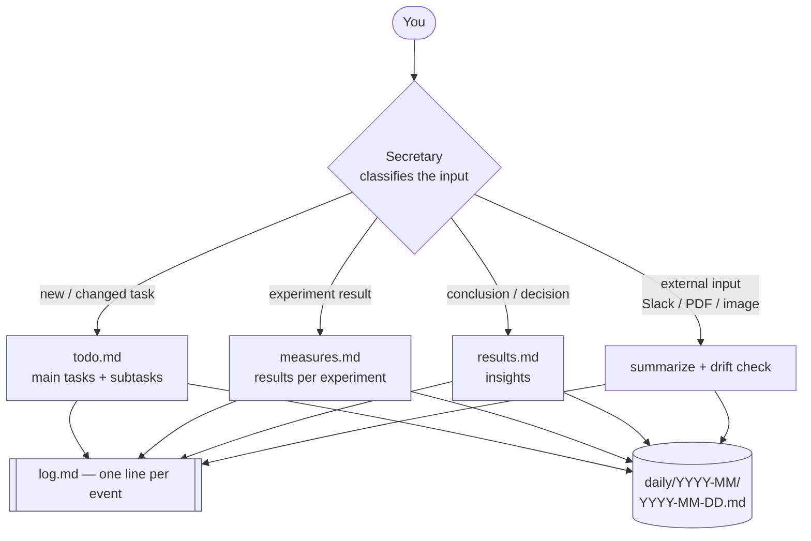
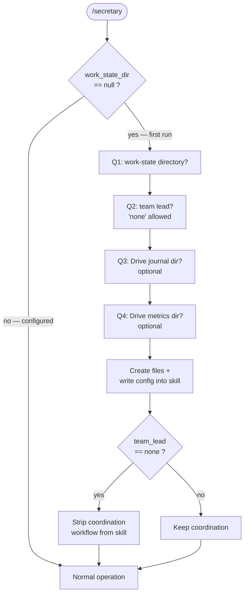
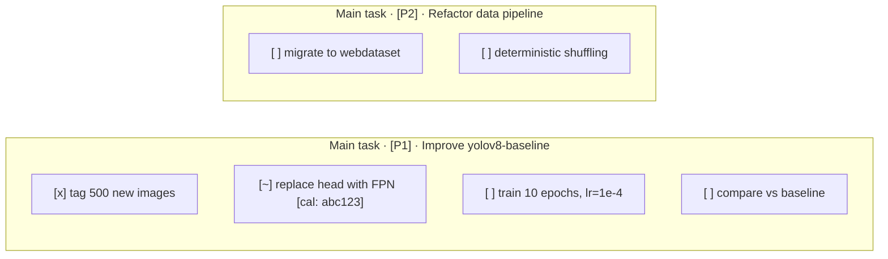
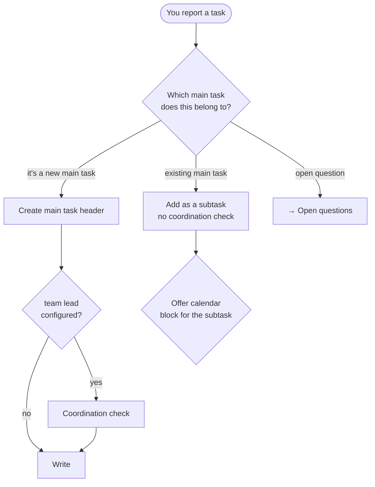
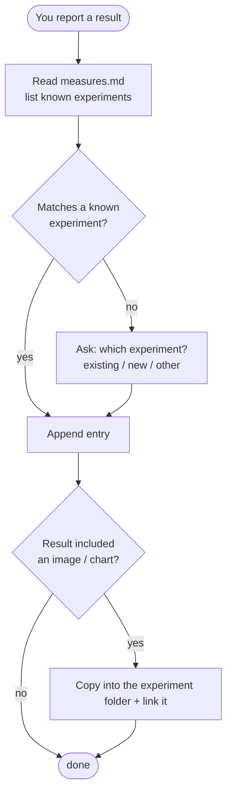
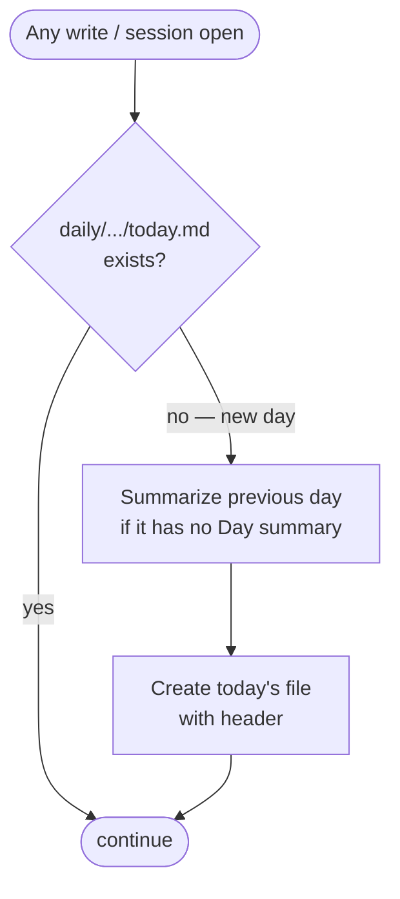

# The Secretary — Live Research Journal

**Secretary** is a single-interface research journal that runs as a Claude Code slash command (`/secretary`). It holds the overall picture of your research, answers queries about what you did and what's pending, detects when you drift away from your active tasks, and routes work to the right place — a TODO list, an experiment-results repository, a conclusions log, and a detailed daily journal.

You talk to it in plain language ("I trained 10 epochs, mAP went to 0.42", "add a task to tag the new data", "what's urgent this week?") and it files each piece of information in the correct place, in a consistent structure, so the journal stays queryable over time.

---

## Table of contents

- [What it's for](#what-its-for)
- [How it works (at a glance)](#how-it-works-at-a-glance)
- [Setup / first run](#setup--first-run)
- [The files it manages](#the-files-it-manages)
- [The task model](#the-task-model)
- [Logging experiment results](#logging-experiment-results)
- [The daily log](#the-daily-log)
- [Querying the journal](#querying-the-journal)
- [Drift detection](#drift-detection)
- [Connectors (MCP)](#connectors-mcp)
- [Boundaries](#boundaries)
- [Worked example: a full session](#worked-example-a-full-session)

---

## What it's for

A research log tends to rot: notes land in random files, experiment numbers get lost, "I'll write it down later" never happens, and three weeks later nobody can reconstruct what was tried. Secretary fixes this by being the **only** thing you talk to, and by enforcing one rule: **every piece of information has exactly one correct home.**

| You say… | It goes to… |
|----------|-------------|
| "add a task to retrain the detector" | `todo.md` |
| "run 7 hit mAP 0.42" | `measures.md` |
| "turns out the FPN head was the bottleneck" | `results.md` |
| "I had a call with the data team" | `log.md` + daily log |
| anything at all | a one-line entry in `log.md` |

---

## How it works (at a glance)



Two invariants hold for every interaction:

1. **`log.md` always gets a one-line entry** — it's the flat, append-only ledger of everything that happened.
2. **Today's daily log is guaranteed to exist before any write** — if the day rolled over, yesterday gets summarized and today's file is created first.

---

## Setup / first run

The skill stores its configuration **inside its own file** (the `## Config` block at the top of `secretary.md`). On first run, the four values are `null`, so Secretary asks you four questions, one at a time, then writes the answers back into itself.



The four questions:

1. **Work-state directory** — a full path. It will hold `log.md`, `todo.md`, `measures.md`, `results.md`, and a `daily/` subdirectory.
2. **Team lead / coordinator** — used for task-coordination markers. **Answer `none` if you work solo** — Secretary then deletes the entire coordination workflow from itself, so it never nags you about coordinating tasks.
3. **(Optional) Drive journal directory** — `none` / `skip` to disable.
4. **(Optional) Drive metrics directory** — `none` / `skip` to disable.

After the answers, Secretary creates the directory tree, the four empty files, and the current month's `daily/` folder, then continues into normal operation.

---

## The files it manages

```
<work_state_dir>/
├── log.md            # append-only ledger — one line per event
├── todo.md           # living document — main tasks, subtasks, open questions
├── measures.md       # experiment results, grouped per experiment
├── results.md        # conclusions / insights (append-only)
├── measures/         # binary attachments for results
│   └── <experiment>/
│       └── 2026-05-20_run3_confusion.png
└── daily/
    └── 2026-05/
        ├── 2026-05-19.md
        └── 2026-05-20.md
```

| File | Access pattern | Purpose |
|------|----------------|---------|
| `log.md` | append only, never read | one-line summary of every request/update |
| `todo.md` | read whole → edit → write | tasks + open questions |
| `measures.md` | read whole → append entry under experiment | flexible results repository |
| `results.md` | append only, never read | conclusions and insights |
| daily log | append only | full details of everything |

---

## The task model

Tasks are **two levels deep**: a **main task** (e.g. "Improve the detection network") contains **subtasks** (the small, specific units of work — "tag the data", "swap the head", "train 10 epochs"). There are no orphan tasks — everything lives under a main task.



**States:** `[ ]` open · `[~]` in progress · `[x]` done
**Priorities:** `[P1]` high · `[P2]` medium (default) · `[P3]` low

When you report a task, Secretary asks where it belongs:



Key rules:

- **Subtasks inherit coordination** from their parent — the coordination check only fires for **new main tasks**.
- **Calendar blocks** are offered only for **new subtasks** (atomic units of work), not for a bare main-task header.
- **Main tasks are never closed automatically** — even when every subtask is `[x]`. You don't know the full set of subtasks in advance, so closing is always an explicit decision.

### Example: `todo.md`

```markdown
# TODO
# Priorities: [P1] high · [P2] medium (default) · [P3] low
# States: [ ] open · [~] in progress · [x] done

## Main tasks

### Improve yolov8-baseline · [P1] · deadline: 2026-06-15 · from Dana
- [x] tag 500 new aerial images — 2026-05-14, completed 2026-05-18
- [~] replace head with FPN — 2026-05-19 [cal: abc123]
- [ ] [P1] train 10 epochs, lr=1e-4 — 2026-05-20
- [ ] compare vs baseline mAP — 2026-05-20

### Refactor data pipeline · [P2]
- [ ] migrate to webdataset format — 2026-05-20

## Open questions
- Should augmentation be on by default for the val set? — 2026-05-20
```

---

## Logging experiment results

`measures.md` is a **flexible repository**, not a fixed table. Metric names are whatever you report. Each entry must make three things clear: **what** was reported, in **what context**, and what it **means**.



### Example: `measures.md`

```markdown
# Measures

## yolov8-baseline — aerial vehicle detector, 640px

### 2026-05-20 · run_3
- **Reported:** mAP@50 = 0.42, precision = 0.55, recall = 0.48
- **Context:** FPN head, 10 epochs, lr=1e-4, +500 newly tagged images
- **Meaning:** +0.07 mAP over run_2 — the new head helps, but recall is
  still the limiting factor. Worth chasing recall next.
- **Attachments:** [confusion-matrix](measures/yolov8-baseline/2026-05-20_run3_confusion.png)
```

If you give numbers but no interpretation, Secretary asks **one** sharp question ("how should this be read vs. the previous run?") rather than inventing meaning.

---

## The daily log

Every day has its own file under `daily/YYYY-MM/`. Before **any** write — and at session open — Secretary runs an idempotent "ensure today's daily log exists" routine: if the day rolled over, it appends a `## Day summary` to the previous day and creates today's file.



### Example: `daily/2026-05/2026-05-20.md`

```markdown
# Journal 2026-05-20

## Activity

### morning — yolov8 run_3
- **What:** trained the FPN-head variant for 10 epochs
- **Data:** mAP@50 0.42, precision 0.55, recall 0.48, lr=1e-4
- **Observations:** new head clearly helps; recall is the bottleneck
- **Decisions:** next run focuses on recall (anchor sizes / augmentation)

## Open questions
- Should augmentation be on by default for the val set?

## Day summary
(written automatically when 2026-05-21 opens)
```

---

## Querying the journal

Ask in natural language; Secretary reads the relevant files and answers in a compact format.

| Ask | You get |
|-----|---------|
| *"What did I do this week?"* | per-main-task activity, key results, what's stuck |
| *"What's the status of yolov8-baseline?"* | a timeline + the result entries for that experiment |
| *"What's urgent?"* | tasks bucketed by 🔴 hours / 🟠 days / 🟡 weeks |
| *"What's stuck?"* | `[~]` subtasks with no progress, experiments with no result, passed deadlines |

Example — *"What's urgent?"*:

```
🔴 hours:  train 10 epochs · due today · Improve yolov8-baseline
🟠 days:   compare vs baseline · due 2026-05-23 · Improve yolov8-baseline
🟡 weeks:  migrate to webdataset · due 2026-06-10 · Refactor data pipeline
```

---

## Drift detection

After Secretary summarizes any **external input** (a Slack thread, a PDF, a screenshot, an email), it compares the new activity against `todo.md`. If the activity doesn't map to any active task, it stops and asks before recording anything:

```
🤔 The input contains activity about: <description>

It does not appear in the active task list.
1. New task to add?
2. Sub-task of <existing item>?
3. Deliberate temporary drift?
4. Misidentification?
```

This is the mechanism that catches "wait, why am I spending time on this?" — work that quietly diverges from the plan.

---

## Connectors (MCP)

Secretary routes different input types to the connectors enabled in the environment:

| Input | Connector | What happens |
|-------|-----------|--------------|
| PDF | `display_pdf` / `list_pdfs` (+ Drive) | extract → summarize to daily log |
| screenshot / image | standard file read | summarize to daily log |
| "scan this Slack thread" + link | Slack | read → summarize → (maybe) create task |
| Drive / Sheets | Drive | fetch journal pages / metrics sheets |
| scheduling a task | Calendar | `suggest_time` → confirm → `create_event` → store `[cal: id]` |
| email follow-up | Gmail | draft only — **never auto-sends** |

---

## Boundaries

Secretary is a precise tool, not an autonomous actor. It will not:

- **fabricate data** — "not recorded" is a legitimate answer;
- **write to Slack**;
- **create a calendar event** without you confirming the slot and title;
- **delete history**;
- **decide on your behalf**.

---

## Worked example: a full session

> **You:** I just finished tagging the 500 new images for the detector.

Secretary asks which main task it belongs to; you pick *Improve yolov8-baseline*. It marks the subtask `[x]`, appends to `log.md`, and updates today's daily log.

> **You:** Add a subtask to train 10 epochs at lr 1e-4.

It adds `[ ] train 10 epochs, lr=1e-4` under the same main task, then offers a calendar block. You say "yes, 2h" → it proposes a slot, you confirm, and it writes `[cal: abc123]` onto the line.

> **You:** run_3 done — mAP 0.42, recall still low at 0.48.

It matches *yolov8-baseline*, appends a `measures.md` entry with Reported / Context / Meaning, and asks you to confirm the interpretation about recall being the bottleneck.

> **You:** What's urgent this week?

It reads `todo.md` and prints the 🔴 / 🟠 / 🟡 buckets.

Every one of those turns also dropped a one-line entry into `log.md` and a detailed block into `daily/2026-05/2026-05-20.md` — so next month, "what did I do back in May?" has a real answer.

---

*Secretary is implemented entirely as a Claude Code slash command. The full behavioral spec lives in [`.claude/commands/secretary.md`](.claude/commands/secretary.md).*
